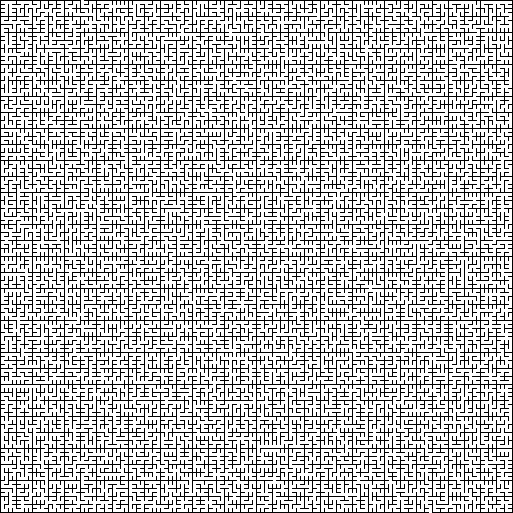
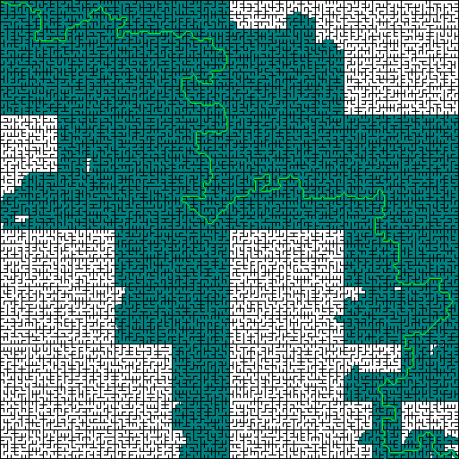
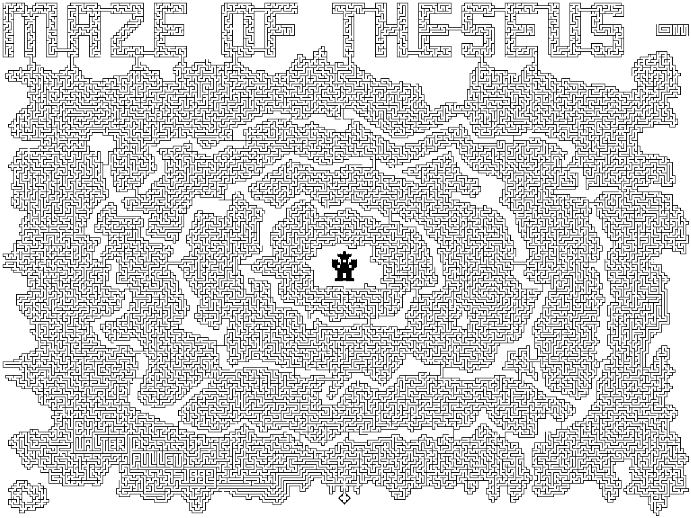
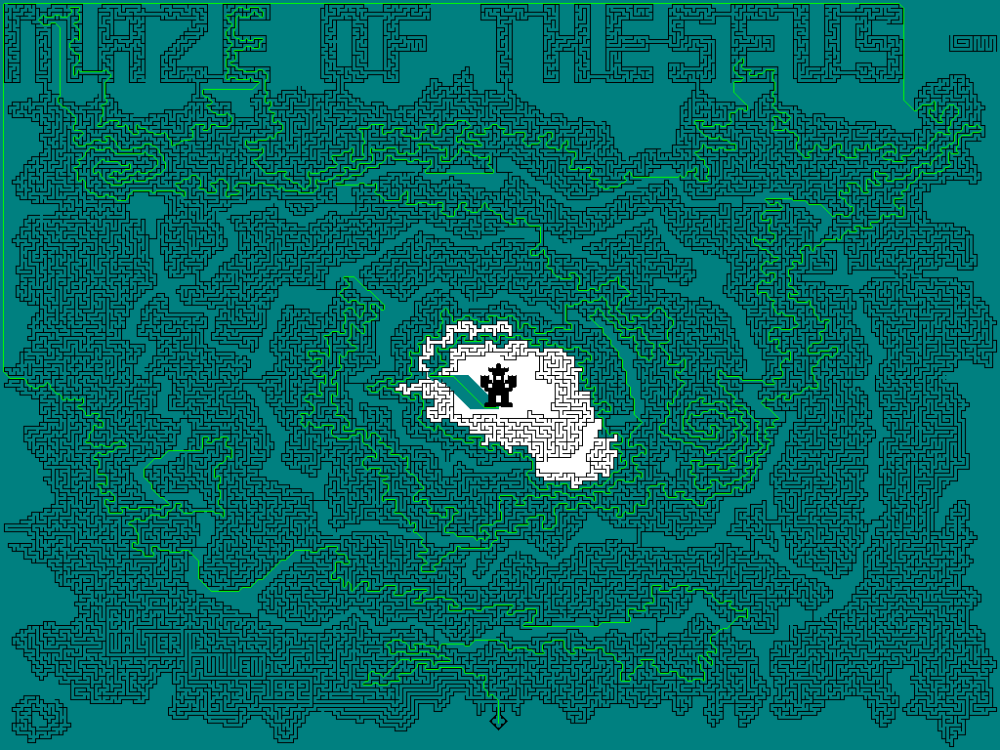
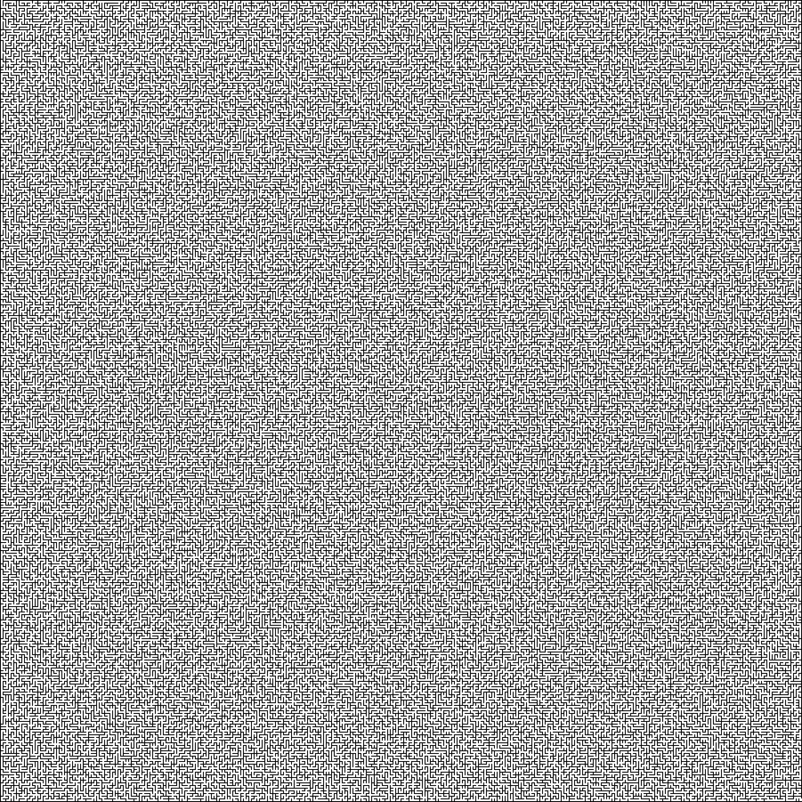
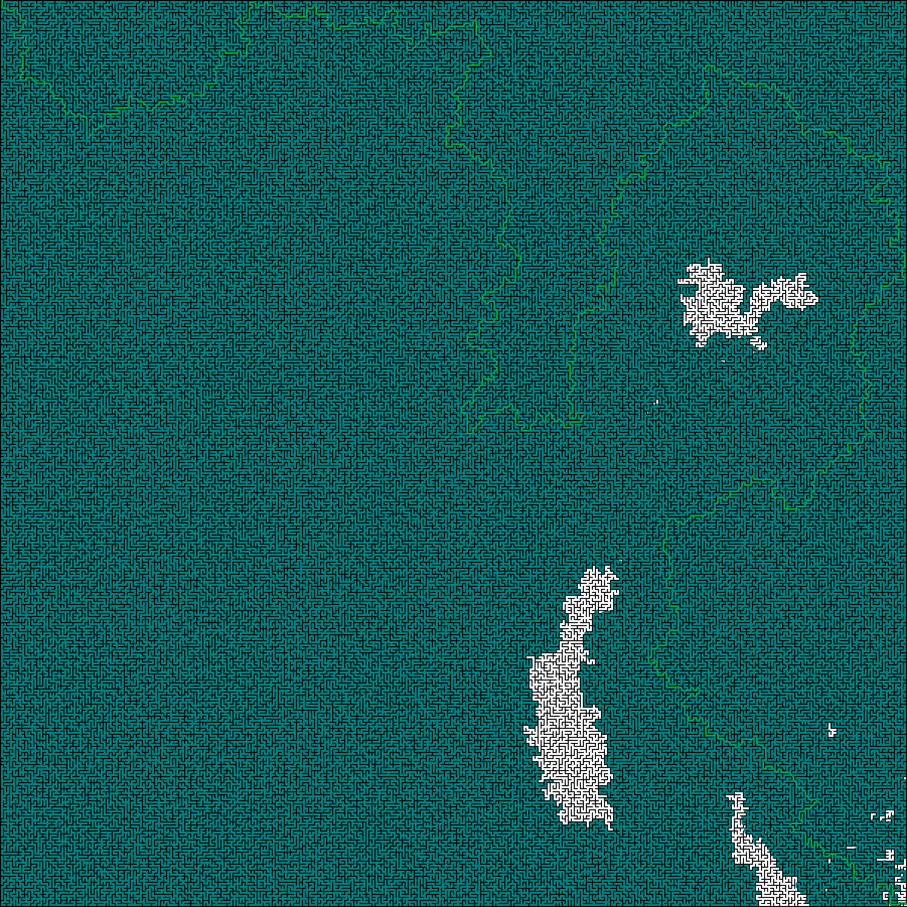

# MazeSolver_using_AStar

An implementation of the A-Star algorithm in pure python. The aim is to show-case an easy to understand implementation of the algorithm. Though the show cased examples are for structured grid, it is pretty easy to make it work for unstructured graph by updating the neighbor search along with their costs

## Running

To install the dependencies, run `pip install -r requirements.txt`. You can then edit/run the `maze_solver.py` to get the results :snowman:

## Approach

One of the common approaches for A-Star is to keep a list of open nodes in a priority queue while also keeping a list of closed nodes. The approach here is that instead of using a priority queue, we use a value sorted dict. This way, we can add update the earlier added entries without the need to create new ones as in the case of priority queue. This leads to upper space bound is `O(n)` where `n` is the number of nodes. The access to value sorted dict is `O(log(n))`. As the implementation primarily focuses on structured grid, the nodes are not created unless they lie on the search path whereas obstacles are directly added to the closed list. Finally, though the code solves the problem is a reasonable amount of time(~3.25 million nodes take ~15sec on current machine), the code can definitely be optimized but usually at the sake of simplicity. Things that led to significant speed gains is wrapping compute intensive function with `numba` `njit` decorator. Also, with more book keeping, unnecessary lookups into the open list dict can be avoided

## Results

One of the common instances of structured grid is images. To test the implementation, we solve mazes and visualize the results though A-Star might not necessarily be the best algorithm to approach such a problem. Here a a few picks, the rest can be found under [here](results/). The sea green color represents the visited nodes whereas the sharp green color indicates the found path

### 263k Nodes

Maze                                    | Solution
:--------------------------------------:|:---------------------------------------------:
 | 

### 786k Nodes

Maze (Credits to [Robot Abbott](https://www.astrolog.org/labyrnth/maze.htm)) | Solution
:-----------------------------------------:|:-----------------------------------------------:
 | 

### 3250k Nodes

Maze                                | Solution
:----------------------------------:|:-----------------------------------------:
 | 
